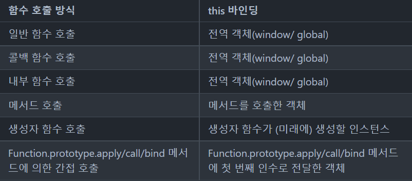

## this란?

- 자신이 속한 객체
- `자신이 생성할 인스턴스`를 가리키는 `자기 참조 변수`

- this를 통해 `자신이 속한 객체` 또는 `자신이 생성할 인스턴스의 프로퍼티나 메서드`를 참조할 수 있다.
- this는 js 엔진에 의해 `암묵적으로 생성`, `코드 어디서든 참조 가능`
- `this가 가리키는 값`, 즉 `this 바인딩`은 `함수 호출 방식`에 의해 `동적 결정`

단 this가 가리키는 값 즉, this 바인딩은 함수 호출 방시에 의해 동적 결정

### this 바인딩이란?

- 바인딩이란 `식별자`(변수)와 `값`(원시 값 또는 객체)을 연결하는 과정
- 예를 들어, 변수 선언은 변수 이름(식별자)과 확보된 메모리 공간의 주소를 바인딩하는 것이다.
- this 바인딩은 this(키워드로 분류되지만 식별자 역할을 한다)와 this가 가리킬 객체를 바인딩하는 것이다.

## this는 동적으로 바인딩이 된다고 하는데 바인딩되는 객체가 어떻게 다르나요?

함수 호출 방식은 아래와 같이 6가지가 존재한다.

1. 일반 함수 호출
2. 콜백 함수 호출
3. 내부 함수 호출
4. 메서드 호출
5. 생성자 함수 호출
6. Function.prototype.apply/call/bind 메서드에 의한 간접 호출
