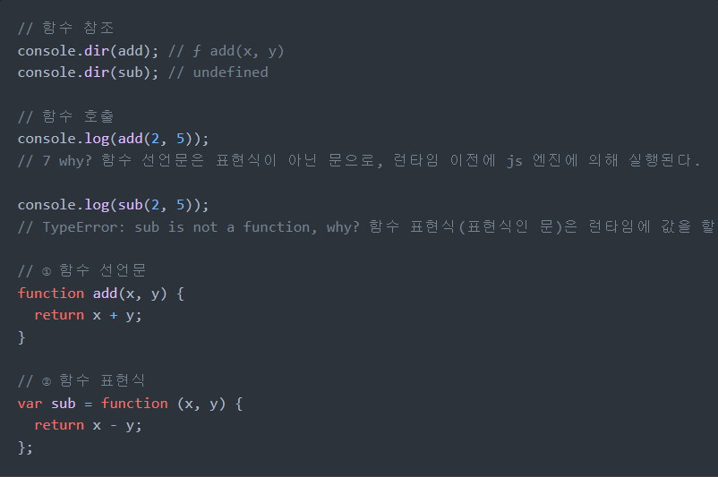

## 자바스크립트에서 함수를 정의하는 방법은 몇가지가 있나요?

1. 함수 `선언문`:(일반적인 방식)
   function add(x,y){
   return x+y;
   }
2. 함수 `표현식`(변수에 넣기)
   var add = function(x,y) {
   return x+ y;
   }
3. Function 생성자 함수
   var add = new Function('x','y','return x+y');

4. 화살표 함수
   var add = (x,y) => x+y;

### 함수 선언문과 함수 표현식은 어떤 차이가 있나요?

- 함수 선언문은 코드의 선두로 끌어 올려진 것처럼 동작한다.(by 호이스팅)
  

### 즉시 실행 함수(IIFE)에 대해 알고 있나요? 알고 있다면 아는 내용에 대해 말해보세요

- IIFE: Immediately Invoked Function Expression

1. 함수 정의와 동시에 즉시 호출되는 함수:즉시 실행 함수
2. 단 한번만 호출되며 다시 호출 불가
